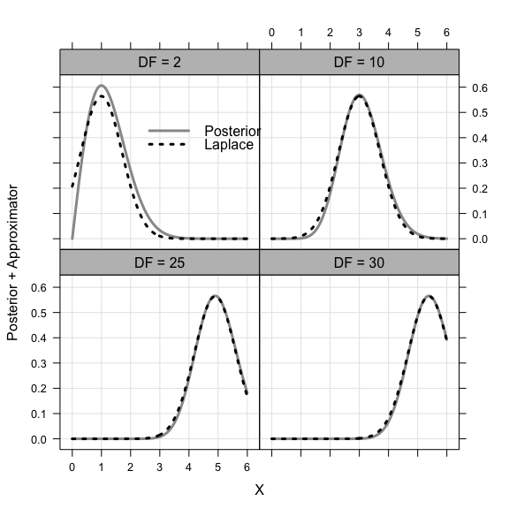
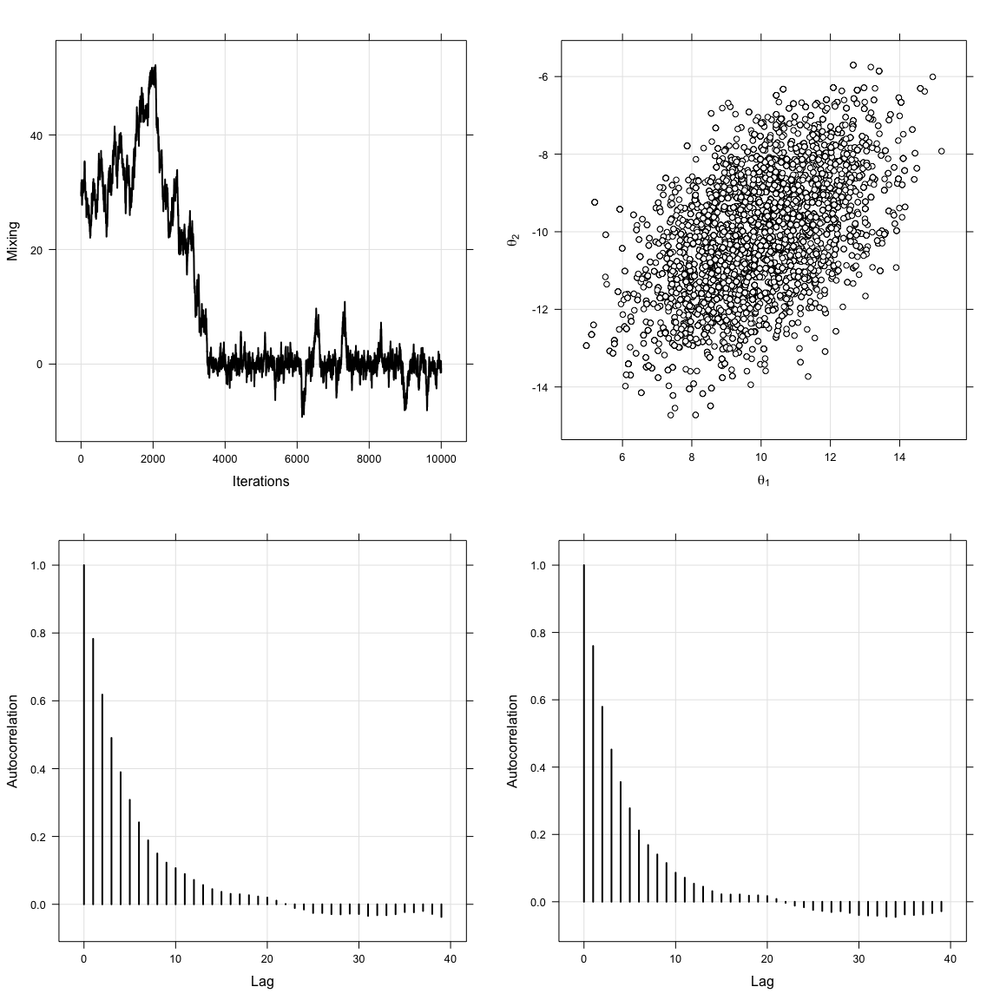
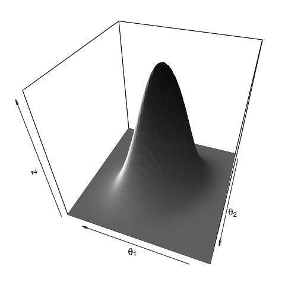
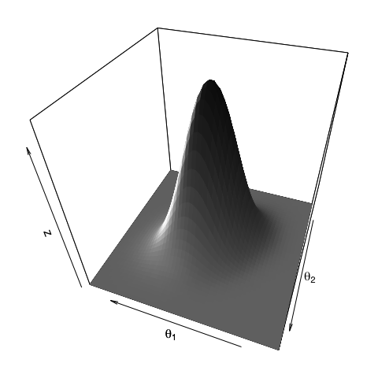
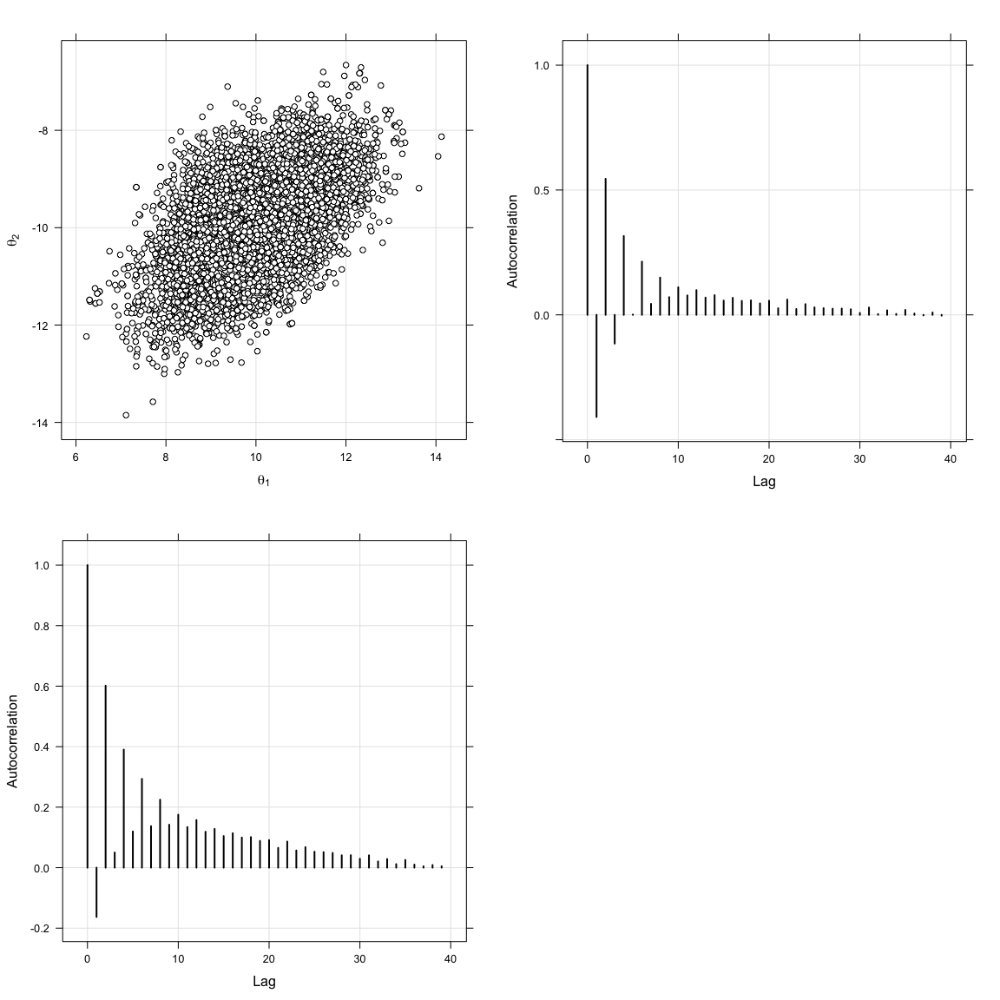
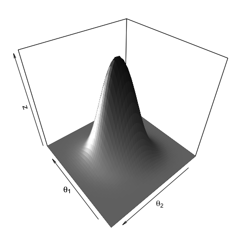

<font color = "#645452">Chapter 3</font>
================

by **Al-Ahmadgaid B. Asaad** (`alstatr.blogspot.com`; `alasaadstat@gmail.com`; `alstated@gmail.com`). This notebook contains source codes used in the thesis.

<table style="width:136%;">
<colgroup>
<col width="19%" />
<col width="116%" />
</colgroup>
<thead>
<tr class="header">
<th align="left"><code>Chapter Title</code></th>
<th align="left"><font color = "#FFA700">Bayesian Inference and Basic Definitions </font></th>
</tr>
</thead>
<tbody>
<tr class="odd">
<td align="left"><code><strong>Thesis Title</strong></code></td>
<td align="left"><font color = "#FFA700"><strong>Bayesian Inference of Artificial Neural Networks and Hidden Markov Models</strong></font></td>
</tr>
</tbody>
</table>

### Laplace Approximation

``` r
dchisq2 <- function (x, df) {
  (x ** (df - 1) * exp(- (x**2) / 2)) / (2 ** (df/2 - 1) * gamma(df / 2))
}

k <- c(2, 10, 25, 30)
x <- seq(0, 6, length = 200)

posterior <- laplace <- list()

j <- 1
for (i in k) {
  posterior[[j]] <- dchisq2(x, i)
  laplace[[j]] <- dnorm(x, sqrt(i - 1), sqrt(.5))
  j <- j + 1
}

laplace_dat <- data.frame(
  X = rep(x, times = 4), 
  DF = rep(c('DF = 2', 'DF = 10', 'DF = 25', 'DF = 30'), each = length(posterior[[1]])), 
  Posterior = c(posterior[[1]], posterior[[2]], posterior[[3]], posterior[[4]]), 
  Approximator = c(laplace[[1]], laplace[[2]], laplace[[3]], laplace[[4]])
)

mytheme <- trellis.par.get()
mytheme$strip.background$col = 'gray'
mytheme$layout.heights$strip = 1.5
trellis.par.set(mytheme)
xyplot(Posterior + Approximator ~ X | factor(DF), data = laplace_dat) %>%
  update(
    index.cond = list(c(3, 4, 2, 1)), type = c('l', 'g'), 
    lwd = 3, lty = c(1, 3), col = c('gray60', 'black')) %>%
  update(
    key = list(
      lines = list(lty = c(1, 3), lwd = c(3, 3), col = c('gray60', 'black')),
      text = list(labels = c('Posterior', 'Laplace')),
      corner = c(.3, .8)
    )
  )
```



### Monte Carlo Simulation

The following codes simulate the monte carlo method by approximating the area under the Gaussian distribution between -1.96 and 1.96.

``` r
set.seed(123)

draws <- seq(100, 10000, by = 100)
area <- draws %>% length %>% numeric

for (i in 1:(draws %>% length)) {
    samples <- rnorm(n = draws[i])
    area[i] <- sum(((samples > -1.96) & (samples < 1.96)) / (samples %>% length))
}

xyplot(area ~ draws, type = c("g", "l"), col = "black") %>%
  update(xlab = "Draws", ylab = "Area")
```


### Metropolis-Hasting

The following codes illustrates the Metropolis-Hasting algorithm by using uniform distribution as the proposal distribution, with target distribution given by univariate Cauchy model.

``` r
set.seed(123)
r <- 1e+4
burnIn <- 5e+2
mu <- matrix(c(10, -10))
sigma <- matrix(c(1.5^2, 1.5*1.35*.5, 1.5*1.35*.5, 1.35^2), 2, 2)

x <- r %>% numeric
x[1] <- 30

for (i in 1:(r - 1)) {
  proposal <- x[i] + runif(1, -1, 1)
  accept <- runif(1) < dcauchy(proposal) / dcauchy(x[i])
  
  if (accept == TRUE) {
    x[i + 1] = proposal
  } else {
    x[i + 1] = x[i]
  }
}

p1 <- xyplot(x ~ 1:r, type = c("g", "l")) %>%
  update(col = "black", lwd = 2) %>%
  update(xlab = "Iterations", ylab = "Mixing")

x <- matrix(NA, r, 2)
x[1, ] <- matrix(c(0, 0))

for (i in 1:(r - 1)) {
  proposal <- x[i, ] + runif(2, -5, 5)
  accept <- runif(1) < (dmvnorm(proposal, mu, sigma) / dmvnorm(x[i, ], mu, sigma))
  if (accept == TRUE) {
    x[i + 1, ] <- proposal
  } else {
    x[i + 1, ] <- x[i, ]
  }
}

p2 <- xyplot(x[(burnIn + 1):r, 2] ~ x[(burnIn + 1):r, 1], type = c("g", "p")) %>%
  update(col = "black", lwd = 2, pch = 21, fill = "white") %>% 
  update(xlab = expression(theta[1]), ylab = expression(theta[2]))

acf1 = acf(x[(burnIn + 1):r, 1], plot = FALSE)
acf2 = acf(x[(burnIn + 1):r, 2], plot = FALSE)
p3 <- xyplot(acf1$acf ~ acf1$lag, type = c('g', 'h'), col = 'black', lwd = 2,
             xlab = 'Lag', ylab = "Autocorrelation")
p4 <- xyplot(acf2$acf ~ acf2$lag, type = c('g', 'h'), col = 'black', lwd = 2,
             xlab = 'Lag', ylab = "Autocorrelation")

grid.arrange(p1, p2, p3, p4, ncol = 2)
```

 Plot in 3-dimension

``` r
# kernel density estimate
est <- bkde2D(x[(burnIn + 1):r, ], bandwidth = c(1, 1))
par(mai = c(.2, .2, .2, .2), family = 'sans')

persp3D(est$x1, est$x2, est$fhat, col = ramp.col(c('gray', 'gray10')), colkey = FALSE, xlab = "", ylab = "",
        theta = 200, phi = 40, lighting = TRUE, ltheta = 110, lphi = 0)
text3D(10, -3, 0, labels = expression(theta[1]), add = TRUE)
text3D(2.9, -9, 0, labels = expression(theta[2]), add = TRUE)
```



### Gibbs Sampling

The following codes uses Gibbs sampler algorithm for taking samples on bivariate normal distribution with mean \[10; -10\] and variance-covariance matrix \[2.2500 1.0125; 1.0125 1.8225\]

``` r
set.seed(123)
con_norm <- function(x, mu_1 = 10, mu_2 = -10, sigma_1 = 1.5, sigma_2 = 1.35, rho = .5) {
  out<-rnorm(1, mean = mu_1 + (sigma_1/sigma_2) * rho * (x - mu_2), sd = sqrt((1 - rho**2) * sigma_1**2))
  return(out)
}

x1 <- c(0); x2 <- c(0)

for(i in 1:r) {
  x1[i + 1] <- con_norm(x2[i])
  x2[i + 1] <- con_norm(x1[i + 1], -10, 10, 1.35, 1.5)
}

p1 <- xyplot(x2[(burnIn + 1):r] ~ x1[(burnIn + 1):r], type = c("g", "p")) %>%
  update(pch = 21, col = 'black', fill = 'white') %>%
  update(
    xlab = expression(theta[1] %~% p(paste(theta[1], '|', theta[2], sep = ''))), 
    ylab = expression(theta[2] %~% p(paste(theta[2], '|', theta[1], sep = '')))
    )

acf1 = acf(x1[burnIn:r] , plot = FALSE)
acf2 = acf(x2[burnIn:r], plot = FALSE)
p2 <- xyplot(acf1$acf ~ acf1$lag, type = c('g', 'h')) %>%
  update(col = 'black', lwd = 2) %>%
  update(xlab = 'Lag', ylab = "Autocorrelation")
p3 <- xyplot(acf2$acf ~ acf2$lag, type = c('g', 'h')) %>%
  update(col = 'black', lwd = 2) %>%
  update(xlab = 'Lag', ylab = "Autocorrelation")

grid.arrange(p1, p2, p3, ncol = 2)
```


``` r
est <- bkde2D(cbind(x1[(burnIn + 1):r], x2[(burnIn + 1):r]), bandwidth = c(1, 1))
par(mai = c(.2, .2, .2, .2), family = 'sans')
persp3D(est$x1, est$x2, est$fhat, col = ramp.col(c('gray', 'gray10')), colkey = FALSE, xlab = "", ylab = "",
        theta = 200, phi = 40, lighting = TRUE, ltheta = 110, lphi = 0)
text3D(10, -2, 0, labels = expression(theta[1]), add = TRUE)
text3D(2, -9, 0, labels = expression(theta[2]), add = TRUE)
```



### Hamiltonian Monte Carlo Algorithm

The following algorithm is an implementation of the Hamiltonian Monte Carlo

``` r
set.seed(123)
eps <- .3
tau <- 20
mu <- matrix(c(10, -10))
sigma <- matrix(c(1.5^2, 1.5*1.35*.5, 1.5*1.35*.5, 1.35^2), 2, 2)

U <- function (x, mu, sigma) {
  t(x - mu) %*% solve(sigma) %*% (x - mu)
}

dU <- function (x, sigma) {
  solve(sigma) %*% (x - mu)
}

K <- function (p) {
  (t(p) %*% p) / 2
}

dK <- function (p) {
  p
}

H <- function (x, p, mu, sigma) {
  U(x, mu, sigma) + K(p)
}

x <- matrix(NA, r, 2)
x[1, ] <- matrix(c(0, 0))

for (n in 1:(r-1)) {
  xNew <- x[n, ]
  p <- rnorm(length(xNew))
  oldE <- H(xNew, p, mu, sigma)
  
  for (t_idx in 1:tau) {
    p <- p - (eps / 2) * dU(xNew, sigma)
    xNew <- xNew + eps * dK(p)
    p <- p - (eps / 2) * dU(xNew, sigma)
  }
  
  newE <- H(xNew, p, mu, sigma)
  dE <- newE - oldE
  
  if (dE < 0) {
    x[n + 1, ] <- xNew
  } else if (runif(1) < exp(-dE)) {
    x[n + 1, ] <- xNew
  } else {
    x[n + 1, ] <- x[n, ]
  }
}

p1 <- xyplot(x[(burnIn + 1):r, 2] ~ x[(burnIn + 1):r, 1], type = c("g", "p")) %>%
  update(pch = 21, col = "black", fill = "white") %>%
  update(xlab = expression(theta[1]), ylab = expression(theta[2]))

# Autocorrelations
acf1 = acf(x[(burnIn + 1):r, 1], plot = FALSE)
acf2 = acf(x[(burnIn + 1):r, 2], plot = FALSE)
p2 <- xyplot(acf1$acf ~ acf1$lag, type = c('g', 'h')) %>%
  update(col = 'black', lwd = 2) %>%
  update(xlab = 'Lag', ylab = "Autocorrelation")
p3 <- xyplot(acf2$acf ~ acf2$lag, type = c('g', 'h')) %>%
  update(col = 'black', lwd = 2) %>%
  update(xlab = 'Lag', ylab = "Autocorrelation")

grid.arrange(p1, p2, p3, ncol = 2)
```



``` r
est <- bkde2D(x[(burnIn + 1):r, ], bandwidth = c(1, 1))
par(mai = c(.2, .2, .2, .2))

persp3D(est$x1, est$x2, est$fhat, col = ramp.col(c('gray', 'gray10')), colkey = FALSE, xlab = "", ylab = "",
        theta = 230, phi = 40, lighting = TRUE, ltheta = 160, lphi = 0)
text3D(10, -4, 0, labels = expression(theta[1]), add = TRUE)
text3D(3.8, -9, 0, labels = expression(theta[2]), add = TRUE)
```



### Bayesian Linear Regression

This section returns the codes used in Example

``` r
set.seed(123)

# Set the parameters
w0 <- -.3; w1 <- -.5; stdev <- 5

# Define Data Parameters
alpha <- 1 / stdev  # for likelihood

# Generate Hypothetical Data
x <- runif(20, -1, 1)
A <- 1 %>% rep(times = 20) %>% cbind(x)
B <- rbind(w0, w1)
f <- A %*% B 
y <- f + rnorm(20, sd = alpha)

# Define Hyperparameters
Imat <- 2 %>% diag # for prior
b <- 2 #for prior
b1 <- (1 / b)**2 # Square this since in R, rnorm uses standard dev

mu <- 0 %>% rep(times = 2) %>% matrix(ncol = 1) # for prior
s <- b1 * Imat # for prior

# Prior
x1 <- seq(-1, 1, length.out = 200)
x2 <- seq(-1, 1, length.out = 200)
Grid <- expand.grid(y1 = x1, y2 = x2)
z <- numeric()
for (i in 1:nrow(Grid)) {
  z[i] <- dmvnorm(x = c(Grid[i, 1], Grid[i, 2]), mu, s)
}
Grid$z <- z; z <- matrix(z, 200, 200, byrow = FALSE)

p1 <- contourplot(z ~ y1 * y2, Grid, aspect = 'xy')
p1 <- p1 %>% update(cuts = 10,  col.regions = ramp.col(), region = TRUE, labels = TRUE) %>%
  update(xlab = expression(w[0]), ylab = expression(w[1])) %>%
  update(panel = function(x, y, ...) {
    panel.contourplot(x, y, ...)
    panel.points(w0, w1, pch = 23, fill = 'white', col = 'white', cex = 1.2)
  }, colorkey = FALSE)

xseq <- seq(-1, 1, length.out = 100)
wprior <- 1 %>% rmvnorm(mean = mu, sigma = s)
y0 <- wprior[1, 1]; y1 <- wprior[1, 2]
f <- y0 + y1 * xseq
p2 <- xyplot(f ~ xseq, aspect = 'yx')
p2 <- p2 %>% update(xlim = c(-1.1, 1.1), ylim = c(-1.1, 1.1), xlab = 'x', ylab = 'y') %>%
  update(type = 'l', col = 'gray60') %>%
  update(panel = function (x, y, ...) {
    panel.grid(h = -1, v = -1)
    panel.xyplot(x, y, ...)
    n <- 20
    for (i in 1:n) {
      wprior <- 1 %>% rmvnorm(mean = mu, sigma = s)
      y0 <- wprior[1, 1]; y1 <- wprior[1, 2]
      f <- y0 + y1 * xseq
      panel.xyplot(xseq, f, type = 'l', col = 'gray60')
    }
  })

# Likelihood of 1st data point
x1 <- seq(-1, 1, length.out = 200) # weight space
x2 <- seq(-1, 1, length.out = 200)
Grid <- expand.grid(y1 = x1, y2 = x2)
alpha <- (1/.2)**2 # since the sd in Gaussian noise is .2
z <- numeric()

for (i in 1:nrow(Grid)) {
  z[i] <- dnorm(x = y[5,], sum(A[1,] * Grid[i,]), alpha)
}

Grid$z <- z; z <- matrix(z, 200, 200, byrow = FALSE)
p3 <- contourplot(z ~ y1 * y2, Grid, aspect = 'xy') 
p3 <- p3 %>% update(xlab = expression(w[0]), ylab = expression(w[1])) %>%
  update(cuts = 10, col.regions = ramp.col(), region = TRUE, labels = TRUE) %>%
  update(panel = function(x, y, ...) {
    panel.contourplot(x, y, ...)
    panel.points(w0, w1, pch = 23, fill = 'white', col = 'white', cex = 1.2)
  }, colorkey = FALSE)

# Posterior for 1st data point
A1 <- A[1,] %>% matrix(ncol = 2)
s1 <- alpha * ((A1 %>% t %*% A1)) + b * Imat
mu1 <- (alpha * (s1) %>% solve) %*% (A1 %>% t) * y[1,]
wprior <- 1 %>% rmvnorm(mean = mu1, sigma = solve(s1))

x1 <- seq(-1, 1, length.out = 200)
x2 <- seq(-1, 1, length.out = 200)
Grid <- expand.grid(y1 = x1, y2 = x2)
z <- numeric()
for (i in 1:nrow(Grid)) {
  z[i] <- dmvnorm(x = c(Grid[i, 1], Grid[i, 2]), mu1, solve(s1))
}
Grid$z <- z; z <- matrix(z, 200, 200, byrow = FALSE)

p4 <- contourplot(z ~ y1 * y2, Grid, aspect = 'xy')
p4 <- p4 %>% update(xlab = expression(w[0]), ylab = expression(w[1])) %>%
  update(cuts = 10,  col.regions = ramp.col(), region = TRUE, labels = TRUE, 
         panel = function(x, y, ...) {
           panel.contourplot(x, y, ...)
           panel.points(w0, w1, pch = 23, fill = 'white', col = 'white', cex = 1.2)
         }, colorkey = FALSE)

# Data Space for 1st data point
p5 <- xyplot(y[1] ~ x[1], aspect = 'yx')
p5 <- p5 %>% update(xlab = 'x', ylab = 'y', xlim = c(-1.1, 1.1), ylim = c(-1.1, 1.1)) %>%
  update(type = 'p', col = 'black',  cex = 1.2, pch = 19) %>%
  update(panel = function (x, y, ...) {
    panel.grid(h = -1, v = -1)
    xseq <- seq(-1, 1, length.out = 100)
    n <- 20
    for (i in 1:n) {
      wprior <- 1 %>% rmvnorm(mean = mu1, sigma = solve(s1))
      y0 <- wprior[1, 1]; y1 <- wprior[1, 2]
      f <- y0 + y1 * xseq
      panel.xyplot(xseq, f, type = 'l', col = 'gray60')
    }
    panel.xyplot(x, y, ...)
  })

# Likelihood for 5th data
x1 <- seq(-1, 1, length.out = 200) # weight space
x2 <- seq(-1, 1, length.out = 200)
Grid <- expand.grid(y1 = x1, y2 = x2)
alpha <- (1/.2)**2 # since the sd in Gaussian noise is .2
z <- numeric()

# Likelihood for 5th data
for (i in 1:nrow(Grid)) {
  z[i] <- dnorm(x = y[5,], sum(A[5,] * Grid[i,]), alpha)
}

Grid$z <- z; z <- matrix(z, 200, 200, byrow = FALSE)

p6 <- contourplot(z ~ y1 * y2, Grid, aspect = 'xy') 
p6 <- p6 %>% update(xlab = expression(w[0]), ylab = expression(w[1])) %>%
  update(cuts = 10,  col.regions = ramp.col(), region = TRUE, labels = TRUE, 
         panel = function(x, y, ...) {
           panel.contourplot(x, y, ...)
           panel.points(w0, w1, pch = 23, fill = 'white', col = 'white', cex = 1.2)
         }, colorkey = FALSE)

# Posterior for 5th data
A2 <- A[1:5,] %>% matrix(ncol = 2)
s2 <- alpha * ((A2 %>% t %*% A2)) + b * Imat
yy <- y[1:5,] %>% matrix
mu2 <- (alpha * (s2) %>% solve) %*% (A2 %>% t) %*% yy
wprior <- 1 %>% rmvnorm(mean = mu2, sigma = solve(s2))

x1 <- seq(-1, 1, length.out = 200)
x2 <- seq(-1, 1, length.out = 200)
Grid <- expand.grid(y1 = x1, y2 = x2)
z <- numeric()
for (i in 1:nrow(Grid)) {
  z[i] <- dmvnorm(x = c(Grid[i, 1], Grid[i, 2]), mu2, solve(s2))
}
Grid$z <- z; z <- matrix(z, 200, 200, byrow = FALSE)

p7 <- contourplot(z ~ y1 * y2, Grid, aspect = 'xy') 
p7 <- p7 %>% update(xlab = expression(w[0]), ylab = expression(w[1])) %>%
  update(cuts = 10,  col.regions = ramp.col(), region = TRUE, labels = TRUE) %>%
  update(panel = function(x, y, ...) {
    panel.contourplot(x, y, ...)
    panel.points(w0, w1, pch = 23, fill = 'white', col = 'white', cex = 1.2)
  }, colorkey = FALSE)

# Data space for 5th data
p8 <- xyplot(y[1:5] ~ x[1:5], aspect = 'yx')
p8 <- p8 %>% update(type = 'p', cex = 1.2, pch = 19, col = 'black') %>% 
  update(xlab = 'x', ylab = 'y', xlim = c(-1.1, 1.1), ylim = c(-1.1, 1.1)) %>% 
  update(panel = function (x, y, ...) {
    panel.grid(h = -1, v = -1)
    xseq <- seq(-1, 1, length.out = 100)
    n <- 20
    for (i in 1:n) {
      wprior <- 1 %>% rmvnorm(mean = mu2, sigma = solve(s2))
      y0 <- wprior[1, 1]; y1 <- wprior[1, 2]
      f <- y0 + y1 * xseq
      panel.xyplot(xseq, f, type = 'l', col = 'gray60')
    }
    panel.xyplot(x, y, ...)
  })

# Likelihood for 20th data
x1 <- seq(-1, 1, length.out = 200) # weight space
x2 <- seq(-1, 1, length.out = 200)
Grid <- expand.grid(y1 = x1, y2 = x2)
alpha <- (1/.2)**2 # since the sd in Gaussian noise is .2

z <- numeric()
for (i in 1:nrow(Grid)) {
  z[i] <- dnorm(x = y[20,], sum(A[20,] * Grid[i,]), alpha)
}

Grid$z <- z; z <- matrix(z, 200, 200, byrow = FALSE)

p9 <- contourplot(z ~ y1 * y2, Grid, aspect = 'xy')
p9 <- p9 %>% update(xlab = expression(w[0]), ylab = expression(w[1])) %>%
  update(cuts = 10,  col.regions = ramp.col(), region = TRUE, labels = TRUE) %>%
  update(panel = function(x, y, ...) {
    panel.contourplot(x, y, ...)
    panel.points(w0, w1, pch = 23, fill = 'white', col = 'white', cex = 1.2)
  }, colorkey = FALSE)

# Posterior for 20th data
A2 <- A[1:20,] %>% matrix(ncol = 2)
s2 <- alpha * ((A2 %>% t %*% A2)) + b * Imat
yy <- y[1:20,] %>% matrix
mu2 <- (alpha * (s2) %>% solve) %*% (A2 %>% t) %*% yy
wprior <- 1 %>% rmvnorm(mean = mu2, sigma = solve(s2))

x1 <- seq(-1, 1, length.out = 200)
x2 <- seq(-1, 1, length.out = 200)
Grid <- expand.grid(y1 = x1, y2 = x2)

z <- numeric()
for (i in 1:nrow(Grid)) {
  z[i] <- dmvnorm(x = c(Grid[i, 1], Grid[i, 2]), mu2, solve(s2))
}
Grid$z <- z; z <- matrix(z, 200, 200, byrow = FALSE)

p10 <- contourplot(z ~ y1 * y2, Grid, aspect = 'xy')
p10 <- p10 %>% update(xlab = expression(w[0]), ylab = expression(w[1])) %>%
  update(cuts = 10,  col.regions = ramp.col(), region = TRUE, labels = TRUE) %>%
  update(panel = function(x, y, ...) {
    panel.contourplot(x, y, ...)
    panel.points(w0, w1, pch = 23, fill = 'white', col = 'white', cex = 1.2)
  }, colorkey = FALSE)

# Data space for 20th data
p11 <- xyplot(y[1:20] ~ x[1:20], aspect = 'yx')
p11 <- p11 %>% update(type = 'p', cex = 1.2, pch = 19, col = 'black') %>%
  update(xlab = 'x', ylab = 'y', xlim = c(-1.1, 1.1), ylim = c(-1.1, 1.1)) %>%
  update(panel = function (x, y, ...) {
         panel.grid(h = -1, v = -1)
         xseq <- seq(-1, 1, length.out = 100)
         n <- 20
         for (i in 1:n) {
           wprior <- 1 %>% rmvnorm(mean = mu2, sigma = solve(s2))
           y0 <- wprior[1, 1]; y1 <- wprior[1, 2]
           f <- y0 + y1 * xseq
           panel.xyplot(xseq, f, type = 'l', col = 'gray60')
         }
         panel.xyplot(x, y, ...)
       })

p11bayes <- xyplot(y[1:20] ~ x[1:20])
p11bayes <- p11bayes %>% update(type = 'p', cex = 1.2, pch = 21, col = 'black', fill = "gray80") %>%
  update(xlab = 'x', ylab = 'y', xlim = c(-1.1, 1.1), ylim = c(-1.1, 1.1)) %>%
  update(panel = function (x, y, ...) {
         panel.grid(h = -1, v = -1)
         xseq <- seq(-1, 1, length.out = 100)
         n <- 500
         for (i in 1:n) {
           wprior <- 1 %>% rmvnorm(mean = mu2, sigma = solve(s2))
           y0 <- wprior[1, 1]; y1 <- wprior[1, 2]
           f <- y0 + y1 * xseq
           panel.xyplot(xseq, f, type = 'l', col = 'gray50')
         }
         panel.xyplot(x, y, ...)
         panel.xyplot(xseq, mu2[1] + mu2[2]*xseq, type = "l", col = "black", lwd = 2)
       })

p0 <- xyplot(1 ~ 1, col = "white", xlab = "", ylab = "") %>%
  update(
    par.settings = list(
      axis.line = list(
        col = "transparent"
        ),
      axis.text = list(col = "transparent")
      )
    )

grid.arrange(
  p0, p1, p2, p3, 
  p4, p5, p6, p7, 
  p8, p9, p10, p11, 
  ncol = 3, widths = rep(1, 3), 
  heights = rep(1,4)
)
```


### Bayesian Linear Regression using Metropolis-Hasting

Previous section demonstrate the use of Bayesian linear regression obtain from derivation. In this section, assuming we cannot integrate the normalizing factor of the posterior distribution and instead resort into MCMC methods. The following codes generates the hypothetical data

``` r
set.seed(123)

# Set the parameters
w0 <- -.3; w1 <- -.5; stdev <- 5

# Define Data Parameters
alpha <- 1 / stdev  # for likelihood

# Generate Hypothetical Data
x <- runif(20, -1, 1)
A <- 1 %>% rep(times = 20) %>% cbind(x)
B <- rbind(w0, w1)
f <- A %*% B 
y <- f + rnorm(20, sd = alpha)

# Define Hyperparameters
Imat <- 2 %>% diag # for prior
b <- 2 #for prior
b1 <- (1 / b)**2 # Square this since in R, rnorm uses standard dev

mu <- 0 %>% rep(times = 2) %>% matrix(ncol = 1) # for prior
s <- b1 * Imat # for prior

xyplot(y ~ x) %>%
  update(xlab = "Independent", ylab = "Dependent") %>%
  update(type = c("g", "p"), pch = 21, fill = "white", col = "black")
```


The log likelihood function is given by the following code:

``` r
loglike <- function (theta, alpha = alpha, x = x, y = y) {
  yhat <- theta[1] + theta[2]*x
  
  likhood <- numeric()
  for (i in 1:length(yhat)) {
    likhood[i] <- dnorm(y[i], yhat[i], alpha)
  }
  
  return (likhood %>% sum)
}
```

Define the log prior and log posterior

``` r
logprior <- function (theta, mu = mu, s = s) {
  w0_prior <- dnorm(theta[1], mu[1,1], s[1,1], log = TRUE)
  w1_prior <- dnorm(theta[2], mu[2,1], s[2,2], log = TRUE)
  w_prior <- c(w0_prior, w1_prior)
   
  w_prior %>% sum %>% return
}

logpost <- function (theta) {
  loglike(theta, alpha = alpha, x = x, y = y) + logprior(theta, mu, s)
}
```

Define the proposal function and the metropolis-Hasting algorithm is given by

``` r
sigmas <- c(1, 1)
proposal <- function (theta) {
  random <- numeric()
  
  for (i in 1:length(theta)) {
    random[i] <- rnorm(1, theta[i], sigmas[i])
  }
  
  random %>% return
}

mh <- function (theta_start, max_iter) {
  chain <- matrix(NA, max_iter + 1, theta_start %>% length)
  chain[1, ] <- theta_start
  
  for (i in 1:max_iter) {
    propose <- proposal(chain[i, ])
    probab <- exp(logpost(propose) - logpost(chain[i, ]))
    
    if (runif(1) < probab){
      chain[i + 1, ] <- propose
    } else {
      chain[i + 1, ] <- chain[i, ] 
    }
  }
  
  chain %>% return
}
```

Apply the function

``` r
mcmc <- mh(c(0, 0), 10000)
w_est <- mcmc[(burnIn + 1):r, ] %>% colMeans

p1 <- histogram(mcmc[(burnIn + 1):r, 1], col = "gray50", border = "white") %>%
  update(xlab = expression(paste("Chain Values of ", w[0]))) %>%
  update(panel = function (x, ...) {
    panel.grid(-1, -1)
    panel.histogram(x, ...)
    panel.abline(v = w0, lty = 2, col = "black", lwd = 2)
  })

p2 <- histogram(mcmc[(burnIn + 1):r, 2], col = "gray50", border = "white") %>%
  update(xlab = expression(paste("Chain Values of ", w[1]))) %>%
  update(panel = function (x, ...) {
    panel.grid(-1, -1)
    panel.histogram(x, ...)
    panel.abline(v = w1, lty = 2, col = "black", lwd = 2)
  })

p3 <- xyplot(mcmc[(burnIn + 1):r, 1] ~ 1:nrow(mcmc[(burnIn + 1):r,]), type = c("g", "l"), col = "gray50", lwd = 1) %>%
  update(xlab = "Iterations", ylab = expression(paste("Chain Values of ", w[0]))) %>%
  update(panel = function (x, y, ...) {
    panel.xyplot(x, y, ...)
    panel.abline(h = w0, col = "black", lty = 2, lwd = 2)
  })

p4 <- xyplot(mcmc[(burnIn + 1):r, 2] ~ 1:nrow(mcmc[(burnIn + 1):r,]), type = c("g", "l"), col = "gray50", lwd = 1) %>%
  update(xlab = "Iterations", ylab = expression(paste("Chain Values of ", w[1]))) %>%
  update(panel = function (x, y, ...) {
    panel.xyplot(x, y, ...)
    panel.abline(h = w1, col = "black", lty = 2, lwd = 2)
  })

p5mh <- xyplot(y ~ x, col = "black", fill = "gray80", cex = 1.2, type = "p", pch = 21) %>% 
  update(xlim = c(-1.1, 1.1), ylim = c(-1.1, 1.1), panel = function(x, y, ...) {
    panel.grid(h = -1, v = -1)
    xseq <- seq(-1, 1, length.out = 100)
    for (i in seq(burnIn + 1, r, by = 19)) {
      yhat <- mcmc[i, 1] + mcmc[i, 2] * xseq
      panel.xyplot(xseq, yhat, type = "l", col = "gray50")  
    }
    panel.xyplot(x, y, ...)
    panel.xyplot(xseq, w_est[1] + w_est[2]*xseq, type = "l", col = "black", lwd = 2)
  })
p5mh
```


``` r
grid.arrange(p1, p2, p3, p4, p5mh, ncol = 2)
```


### Bayesian Linear Regression using Hamiltonian Monte Carlo

``` r
set.seed(123)
eps <- .3
tau <- 20

U <- function (theta) {
  -logpost(theta) 
}

dU <- function (theta, alpha, x, y, b) {
  c(
    - alpha * sum(y - (theta[1] + theta[2] * x)),
    - alpha * sum((y - (theta[1] + theta[2] * x)) * x)
  ) + b * theta
}

K <- function (p) {
  (t(p) %*% p) / 2
}

dK <- function (p) {
  p
}

H <- function (theta, p) {
  U(theta) + K(p)
}

chain <- matrix(NA, nrow = r, ncol = 2)
chain[1, ] <- c(0, 0)

for (n in 1:(r-1)) {
  theta <- chain[n, ]
  p <- rnorm(length(theta))
  oldE <- H(theta, p)

  for (t_idx in 1:tau) {
    p <- p - (eps / 2) * dU(theta, alpha, x, y, b) 
    theta <- theta + eps * dK(p)
    p <- p - (eps / 2) * dU(theta, alpha, x, y, b) 
  }
  
  newE <- H(theta, p)
  dE <- newE - oldE
  
  if (dE < 0) {
    chain[n + 1, ] <- theta
  } else if (runif(1) < exp(-dE)) {
    chain[n + 1, ] <- theta
  } else {
    chain[n + 1, ] <- chain[n, ]
  }
}
w_est <- chain[(burnIn + 1):r, ] %>% colMeans

p1 <- histogram(chain[(burnIn + 1):r, 1], col = "gray50", border = "white") %>%
  update(xlab = expression(paste("Chain Values of ", w[0]))) %>%
  update(panel = function (x, ...) {
    panel.grid(-1, -1)
    panel.histogram(x, ...)
    panel.abline(v = w0, lty = 2, col = "black", lwd = 2)
  })

p2 <- histogram(chain[(burnIn + 1):r, 2], col = "gray50", border = "white") %>%
  update(xlab = expression(paste("Chain Values of ", w[1]))) %>%
  update(panel = function (x, ...) {
    panel.grid(-1, -1)
    panel.histogram(x, ...)
    panel.abline(v = w1, lty = 2, col = "black", lwd = 2)
  })

p3 <- xyplot(chain[(burnIn + 1):r, 1] ~ 1:nrow(chain[(burnIn + 1):r, ]), type = c("g", "l"), col = "gray50", lwd = 1) %>%
  update(xlab = "Iterations", ylab = expression(paste("Chain Values of ", w[0]))) %>%
  update(panel = function (x, y, ...) {
    panel.xyplot(x, y, ...)
    panel.abline(h = w0, col = "black", lty = 2, lwd = 2)
  })

p4 <- xyplot(chain[(burnIn + 1):r, 2] ~ 1:nrow(chain[(burnIn + 1):r,]), type = c("g", "l"), col = "gray50", lwd = 1) %>%
  update(xlab = "Iterations", ylab = expression(paste("Chain Values of ", w[1]))) %>%
  update(panel = function (x, y, ...) {
    panel.xyplot(x, y, ...)
    panel.abline(h = w1, col = "black", lty = 2, lwd = 2)
  })

p5hmc <- xyplot(y ~ x, col = "black", fill = "gray80", cex = 1.2, type = "p", pch = 21) %>% 
  update(xlim = c(-1.1, 1.1), ylim = c(-1.1, 1.1), panel = function(x, y, ...) {
    panel.grid(h = -1, v = -1)
    xseq <- seq(-1, 1, length.out = 100)
    for (i in seq(burnIn + 1, r, by = 19)) {
      yhat <- chain[i, 1] + chain[i, 2] * xseq
      panel.xyplot(xseq, yhat, type = "l", col = "gray50")  
    }
    panel.xyplot(x, y, ...)
    panel.xyplot(xseq, w_est[1] + w_est[2]*xseq, type = "l", col = "black", lwd = 2)
  })

grid.arrange(p1, p2, p3, p4, p5hmc, ncol = 2)
```


