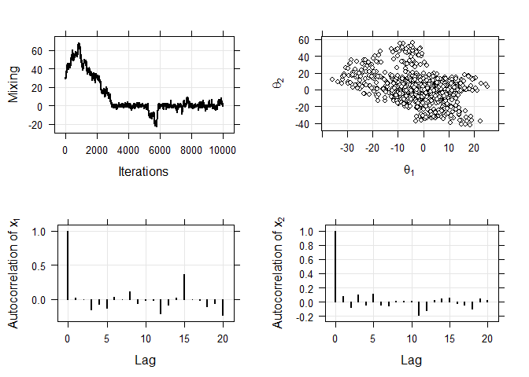
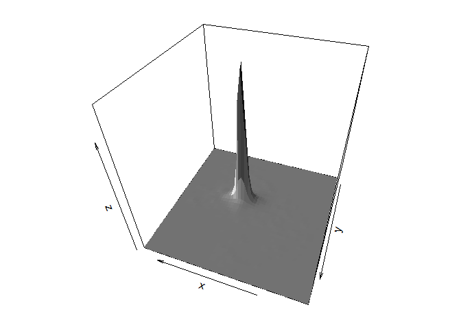
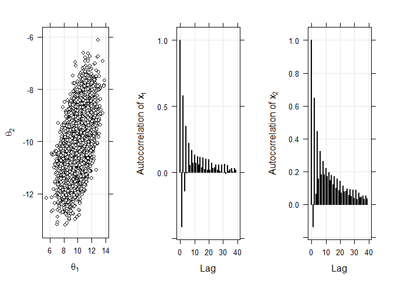
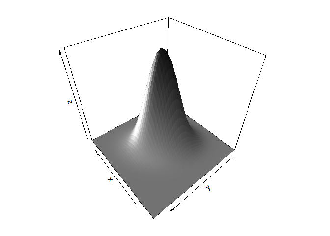

Markov Chain Monte Carlo Methods
================

From the Thesis: **Bayesian Inference of Artificial Neural Networks and Hidden Markov Models Hybrids**<br/> by **Al-Ahmadgaid B. Asaad** (`alstatr.blogspot.com`; `alasaadstat@gmail.com`)<br/> <br/><br/> This notebook is meant to provide the source code for the Bayesian Inference of MCMC methods in Chapter 3.

### i. Monte Carlo Simulation

The following codes simulate the monte carlo method by approximating the area under the Gaussian distribution between -1.96 and 1.96.

``` r
library(magrittr)
library(gridExtra)
library(lattice)
library(plot3D)
library(KernSmooth)
```

    ## KernSmooth 2.23 loaded
    ## Copyright M. P. Wand 1997-2009

``` r
draws <- seq(1000, 100000, by = 100)
area <- draws %>% length %>% numeric

for (i in 1:(draws %>% length)) {
    samples <- rnorm(n = draws[i])
    area[i] <- sum(((samples > -1.96) & (samples < 1.96)) / (samples %>% length))
}
```

### ii. Metropolis-Hasting

The following codes illustrates the Metropolis-Hasting algorithm by using uniform distribution as the proposal distribution, with target distribution given by univariate Cauchy model.

``` r
# Monte Carlo Simulation
set.seed(12345)
r <- 1e+4
x <- r %>% numeric
x[1] <- 30

for (i in 1:(r - 1)) {
  proposal <- x[i] + runif(1, -1, 1)
  accept <- runif(1) < dcauchy(proposal) / dcauchy(x[i])
  
  if (accept == TRUE) {
    x[i + 1] = proposal
  } else {
    x[i + 1] = x[i]
  }
}

p1 <- xyplot(x ~ 1:r, type = c("g", "l"), col = "black", lwd = 2,
             xlab = "Iterations", ylab = "Mixing")

BvCauchy <- function (x, mu = matrix(c(0, 0)), gamma = 1) {
  (1 / 2*pi) * (gamma / ((x[1] - mu[1])^2 + (x[2] - mu[2])^2 +gamma^2)^1.5)
}

x <- matrix(NA, r, 2)
x[1, ] <- matrix(c(0, 0))

for (i in 1:(r - 1)) {
  proposal <- x[i, ] + runif(2, -5, 5)
  accept <- runif(1) < (BvCauchy(proposal) / BvCauchy(x[i, ]))
  if (accept == TRUE) {
    x[i + 1, ] <- proposal
  } else {
    x[i + 1, ] <- x[i, ]
  }
}

p2 <- xyplot(x[, 2] ~ x[, 1], type = c("g", "p"), col = "black", lwd = 2, pch = 21, fill = "white", xlab = expression(theta[1]), ylab = expression(theta[2]))

# Obtain ACF of thinned x1 and x2
acf1 = acf(x[seq(100, r, by = 100),1], plot = FALSE)
acf2 = acf(x[seq(100, r, by = 100),2], plot = FALSE)
p3 <- xyplot(acf1$acf ~ acf1$lag, type = c('g', 'h'), col = 'black', lwd = 2,
             xlab = 'Lag', ylab = expression(paste('Autocorrelation of  ', x[1])))
p4 <- xyplot(acf2$acf ~ acf2$lag, type = c('g', 'h'), col = 'black', lwd = 2,
             xlab = 'Lag', ylab = expression(paste('Autocorrelation of  ', x[2])))

grid.arrange(p1, p2, p3, p4, ncol = 2)
```

<!-- -->

``` r
# kernel density estimate
est <- bkde2D(x, bandwidth = c(1, 1))
par(mai = c(.2, .2, .2, .2), family = 'sans')

persp3D(est$x1, est$x2, est$fhat, col = ramp.col(c('gray', 'gray10')), colkey = FALSE, 
        theta = 200, phi = 40, lighting = TRUE, ltheta = 110, lphi = 0)
```

<!-- -->

### Gibbs Sampling

The following codes uses Gibbs sampler algorithm for taking samples on bivariate normal distribution

``` r
con_norm <- function(x, mu_1 = 10, mu_2 = -10, sigma_1 = 1.5, sigma_2 = 1.35, rho = .5) {
  out<-rnorm(1, mean = mu_1 + (sigma_1/sigma_2) * rho * (x - mu_2), sd = sqrt((1 - rho**2) * sigma_1**2))
  return(out)
}

x1 <- c(0); x2 <- c(0)

for(i in 1:r) {
  x1[i + 1] <- con_norm(x2[i])
  x2[i + 1] <- con_norm(x1[i + 1], -10, 10, 1.35, 1.5)
}

p1 <- xyplot(x2[1000:r] ~ x1[1000:r], pch = 21, col = 'black', fill = 'white',
             type = c("g", "p"), xlab = expression(theta[1] %~% p(paste(theta[1], '|', theta[2], sep = ''))), 
             ylab = expression(theta[2] %~% p(paste(theta[2], '|', theta[1], sep = ''))))

acf1 = acf(x1[1000:r] , plot = FALSE)
acf2 = acf(x2[1000:r], plot = FALSE)
p2 <- xyplot(acf1$acf ~ acf1$lag, type = c('g', 'h'), col = 'black', lwd = 2,
             xlab = 'Lag', ylab = expression(paste('Autocorrelation of  ', x[1])))
p3 <- xyplot(acf2$acf ~ acf2$lag, type = c('g', 'h'), col = 'black', lwd = 2,
             xlab = 'Lag', ylab = expression(paste('Autocorrelation of  ', x[2])))
grid.arrange(p1, p2, p3, ncol = 3)
```

<!-- -->

``` r
est <- bkde2D(cbind(x1, x2), bandwidth = c(1, 1))
par(mai = c(.2, .2, .2, .2), family = 'sans')
p4 <- persp3D(est$x1, est$x2, est$fhat, col = ramp.col(c('gray', 'gray10')), colkey = FALSE, 
              theta = 200, phi = 40, lighting = TRUE, ltheta = 110, lphi = 0)
```

<!-- -->

### Hamiltonian Monte Carlo Algorithm

The following algorithm is an implementation of the Hamiltonian Monte Carlo

``` r
eps <- .3
tau <- 20
mu <- matrix(c(10, -10))
sigma <- matrix(c(1.5^2, 1.5*1.35*.5, 1.5*1.35*.5, 1.35^2), 2, 2)

U <- function (x, mu, sigma) {
  t(x - mu) %*% solve(sigma) %*% (x - mu)
}

dU <- function (x, sigma) {
  solve(sigma) %*% (x - mu)
}

K <- function (p) {
  (t(p) %*% p) / 2
}

dK <- function (p) {
  p
}

H <- function (x, p, mu, sigma) {
  U(x, mu, sigma) + K(p)
}

x <- matrix(NA, r, 2)
x[1, ] <- matrix(c(0, 0))

for (n in 1:(r-1)) {
  xNew <- x[n, ]
  p <- rnorm(length(xNew))
  oldE <- H(xNew, p, mu, sigma)
  
  for (t_idx in 1:tau) {
    p <- p - (eps / 2) * dU(xNew, sigma)
    xNew <- xNew + eps * dK(p)
    p <- p - (eps / 2) * dU(xNew, sigma)
  }
  
  newE <- H(xNew, p, mu, sigma)
  dE <- newE - oldE
  
  if (dE < 0) {
    x[n + 1, ] <- xNew
  } else if (runif(1) < exp(-dE)) {
    x[n + 1, ] <- xNew
  } else {
    x[n + 1, ] <- x[n, ]
  }
}

p1 <- xyplot(x[1000:r, 2] ~ x[1000:r, 1], type = c("g", "p"), pch = 21, 
             col = "black", fill = "white", 
             xlab = expression(theta[1]), ylab = expression(theta[2]))

# Autocorrelations
acf1 = acf(x[1000:r, 1], plot = FALSE)
acf2 = acf(x[1000:r, 2], plot = FALSE)
p2 <- xyplot(acf1$acf ~ acf1$lag, type = c('g', 'h'), col = 'black', lwd = 2,
             xlab = 'Lag', ylab = expression(paste('Autocorrelation of  ', x[1])))
p3 <- xyplot(acf2$acf ~ acf2$lag, type = c('g', 'h'), col = 'black', lwd = 2,
             xlab = 'Lag', ylab = expression(paste('Autocorrelation of  ', x[2])))
grid.arrange(p1, p2, p3, ncol = 3)
```

<!-- -->

``` r
est <- bkde2D(x[1000:r, ], bandwidth = c(1, 1))
par(mai = c(.2, .2, .2, .2))

persp3D(est$x1, est$x2, est$fhat, col = ramp.col(c('gray', 'gray10')), colkey = FALSE, 
        theta = 230, phi = 40, lighting = TRUE, ltheta = 160, lphi = 0)
```

<!-- -->

### Bayesian Linear Regression

This section returns the codes used in Example

``` r
library(mvtnorm)

# Set the parameters
w0 <- -.3; w1 <- .5

# Generate Hypothetical Data
x <- runif(20, -1, 1)
A <- 1 %>% rep(times = 20) %>% cbind(x)
B <- rbind(w0, w1)
f <- A %*% B 
y <- f + rnorm(20, sd = .2)

Imat <- 1 %>% diag(2, 2)
b <- 2
b1 <- (1 / b)**2 # Square this since in R, rnorm uses standard dev

mu <- 0 %>% rep(times = 2) %>% matrix(ncol = 1)
s <- b1 * Imat

# Prior
x1 <- seq(-1, 1, length.out = 200)
x2 <- seq(-1, 1, length.out = 200)
Grid <- expand.grid(y1 = x1, y2 = x2)
z <- numeric()
for (i in 1:nrow(Grid)) {
  z[i] <- dmvnorm(x = c(Grid[i, 1], Grid[i, 2]), mu, s)
}
Grid$z <- z; z <- matrix(z, 200, 200, byrow = FALSE)

p1 <- contourplot(z ~ y1 * y2, Grid, cuts = 10,  col.regions = ramp.col(), region = TRUE, xlab = expression(w[0]), ylab = expression(w[1]), labels = TRUE, aspect = 'xy',
                  panel = function(x, y, ...) {
                    panel.contourplot(x, y, ...)
                    panel.points(w0, w1, pch = 23, fill = 'white', col = 'white', cex = 1.2)
                  }, colorkey = FALSE)

xseq <- seq(-1, 1, length.out = 100)
wprior <- 1 %>% rmvnorm(mean = mu, sigma = s)
y0 <- wprior[1, 1]; y1 <- wprior[1, 2]
f <- y0 + y1 * xseq
p2 <- xyplot(f ~ xseq, type = 'l', col = 'gray60', xlim = c(-1.1, 1.1), ylim = c(-1.1, 1.1), aspect = 'yx',
             xlab = 'x', ylab = 'y',
             panel = function (x, y, ...) {
               panel.grid(h = -1, v = -1)
               panel.xyplot(x, y, ...)
               n <- 20
               for (i in 1:n) {
                 wprior <- 1 %>% rmvnorm(mean = mu, sigma = s)
                 y0 <- wprior[1, 1]; y1 <- wprior[1, 2]
                 f <- y0 + y1 * xseq
                 panel.xyplot(xseq, f, type = 'l', col = 'gray60')
               }
             })

# Likelihood of 1st data point
x1 <- seq(-1, 1, length.out = 200) # weight space
x2 <- seq(-1, 1, length.out = 200)
Grid <- expand.grid(y1 = x1, y2 = x2)
alpha <- (1/.2)**2 # since the sd in Gaussian noise is .2
z <- numeric()

for (i in 1:nrow(Grid)) {
  z[i] <- dnorm(x = y[5,], sum(A[1,] * Grid[i,]), alpha)
}

Grid$z <- z; z <- matrix(z, 200, 200, byrow = FALSE)
p3 <- contourplot(z ~ y1 * y2, Grid, cuts = 10,  col.regions = ramp.col(), region = TRUE, xlab = expression(w[0]), ylab = expression(w[1]), labels = TRUE, aspect = 'xy',
                  panel = function(x, y, ...) {
                    panel.contourplot(x, y, ...)
                    panel.points(w0, w1, pch = 23, fill = 'white', col = 'white', cex = 1.2)
                  }, colorkey = FALSE)


# Posterior of 1st data point
A1 <- A[1,] %>% matrix(ncol = 2)
s1 <- alpha * ((A1 %>% t %*% A1)) + b * Imat
mu1 <- (alpha * (s1) %>% solve) %*% (A1 %>% t) * y[1,]
wprior <- 1 %>% rmvnorm(mean = mu1, sigma = solve(s1))

x1 <- seq(-1, 1, length.out = 200)
x2 <- seq(-1, 1, length.out = 200)
Grid <- expand.grid(y1 = x1, y2 = x2)
z <- numeric()
for (i in 1:nrow(Grid)) {
  z[i] <- dmvnorm(x = c(Grid[i, 1], Grid[i, 2]), mu1, solve(s1))
}
Grid$z <- z; z <- matrix(z, 200, 200, byrow = FALSE)

p4 <- contourplot(z ~ y1 * y2, Grid, cuts = 10,  col.regions = ramp.col(), region = TRUE, xlab = expression(w[0]), ylab = expression(w[1]), labels = TRUE, aspect = 'xy',
            panel = function(x, y, ...) {
              panel.contourplot(x, y, ...)
              panel.points(w0, w1, pch = 23, fill = 'white', col = 'white', cex = 1.2)
            }, colorkey = FALSE)
p0 <- xyplot(1 ~ 1, col = "white")
grid.arrange(p0, p1, p2, p3, p4, ncol = 3)
```

<!-- -->
